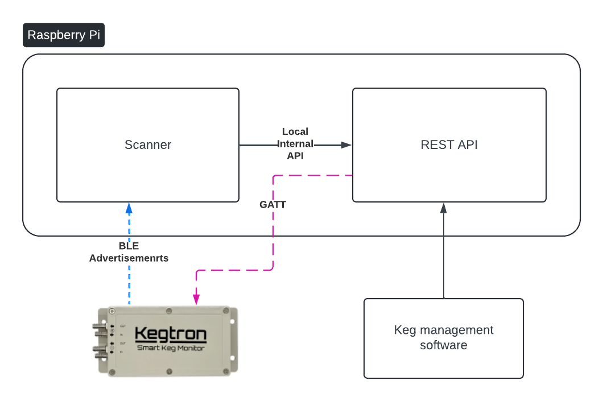

# Kegtron Gen 1 API Proxy

The [Kegtron Gen 1](https://kegtron.com/gen1/) is an BLE (bluetooth low energy) device that allows you track the amount of liquid that passes through it.  Specifically designed to track how much beer is dispensed through a tap.  However, its limitation is that it is bound to BLEs short distance radius.  Their app is excellent for managing these devices when you are within proximity, but if you manage multiple from a remote application, or manage from multiple locations, this does not work.  This API proxy aims to solve this problem.  This provides and HTTP(s) REST proxy so you can extend support for your monitors.  The API aims to mirror the APIs for Kegtron's Pro devices so integration with both is simplified.  However, these devices are different so the APIs will differ slightly.

## Components:

- **Host:** While this application is written in python, it relies one the [bleak](https://github.com/hbldh/bleak) module for the BLE communications.  Therefore must run on a supported operating system.  However, we have designed this specifically to run on a [Raspberry Pi](https://www.raspberrypi.com/) running a [64-bit Operating System](https://www.raspberrypi.com/news/raspberry-pi-os-64-bit/).
- **Scanner**: This process actively scans BLE advertisement packets and filters out anything Kegtron specific.  Any changes on the device are sent to the REST API service.  Updates are only sent when the device values change or the update cache window has passed.
- **REST API**: This service gets the device state from scanner and provides RESTful API for external applications to pull for the state.  *__FUTURE:__ This will also provide external applications an RPC interface to send updates to the device(s)*